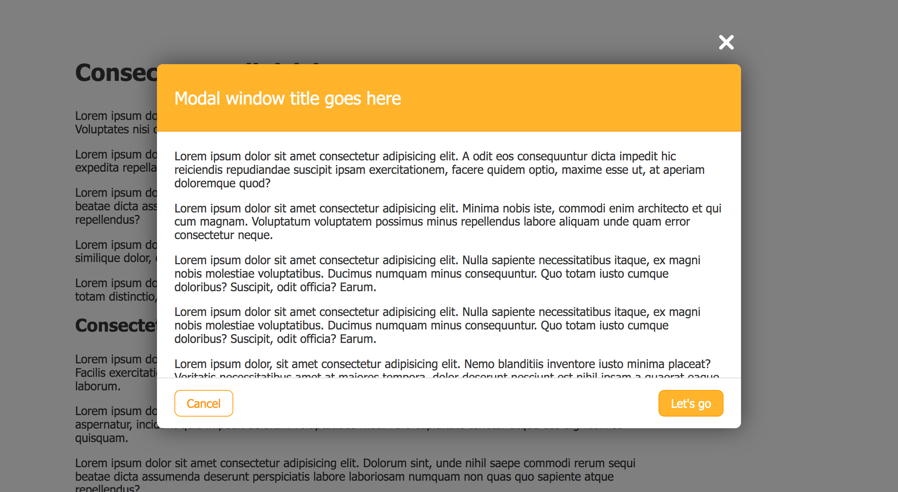
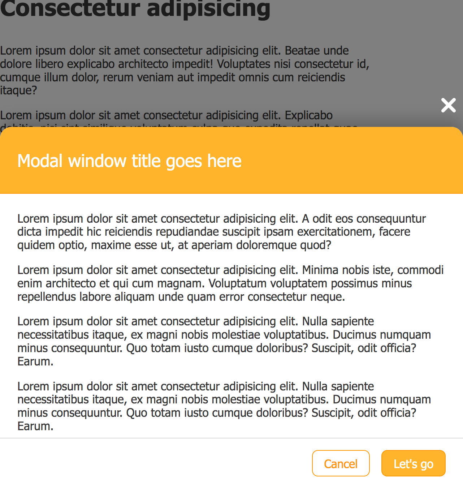
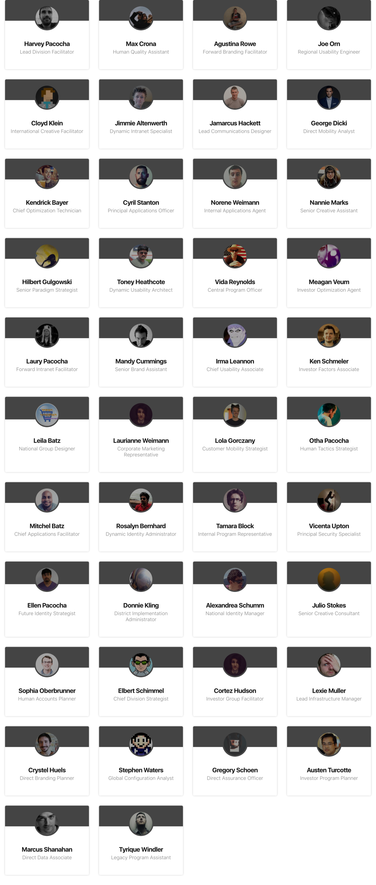
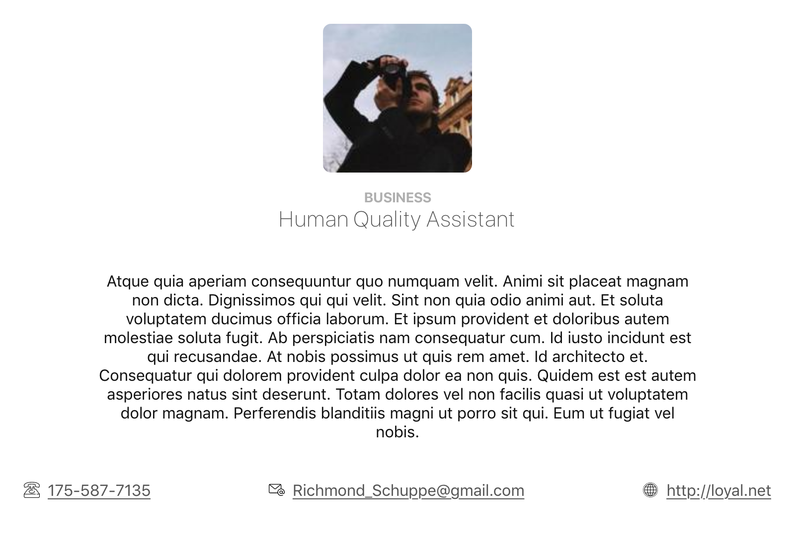
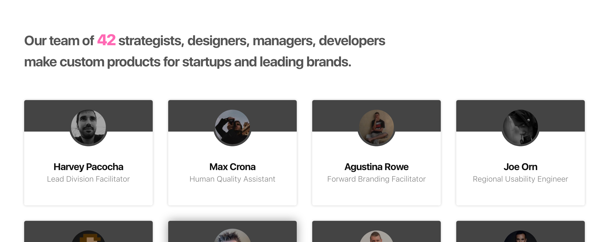
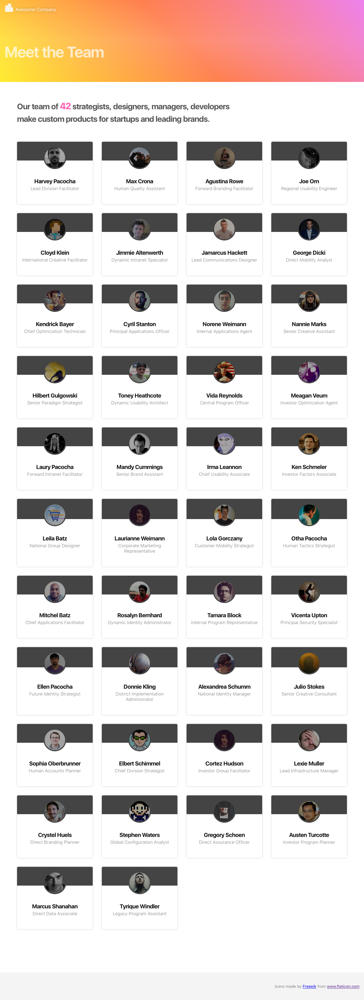

# Interactive Modal

Remeber the modal we did in UI Basics? Let's bring it to life with React.

## Modal component

Let's start by creating a `Modal` component.
Feel free to reuse the markup and CSS from the UI Basics exercise, or start from scratch - your choice!

This is how the `Modal` should look like on desktop:

and on mobile:

### Requirements

Modal title should be customizable, meaning you can pass text to display as modal title.

Modal content should be any HTML. You can achieve this with `props.children`, take a look at the [docs](https://reactjs.org/docs/glossary.html#propschildren).

The `Modal` component should be themeable with the following themes:

- `sunshine` - look at the example above
- `deep-purple` -
  
- `roasted-peppers` -
  
- default -> black colors

There should also be reasonable defaults for the button labels. It should be possible to add also custom labels for:

- left button
- right button

The `Modal` component should allow a custom action to be performed on modal close. Props can have different values - string, number, array, object... but also functions. We can then call the function passed via the prop from the child component.

## List employees

`employee.json` contains a list of employees. Let's display all of them:

Each emplyoee card should display:

- name
- image
- job description of the employee

## Employee details

Let's show more details about the employee. On click on an employee card, a modal should open displaying additional details.

The title of the modal should be full name of the emplyoee.

In the content area of the modal should be displayed:

- image
- department
- job description
- bio
- contacts list

The modal theme is determined by the department the employee is in:

- business - `sunshine`
- engineering - `deep-purple`
- design - `roasted-peppers`

## Next / Previous employee

Let's add some functionality to the buttons.
The right one should say: `Next`, the left one should display: `Previous`.

Modify the `Modal` component to allow to pass custom functions for:

- left button click
- right button click

On click on next - show next emplyoee in list.
On click on previous - show previous employee in list.

## Intro text

To make the page look more complete, let's add some intro text right above the list of employees:

Text for intro: Our team of 23 strategists, designers, managers, developers make custom products for startups and leading brands.

In the above sentence `23` should be the actual number of employees.

## Add site header and site footer

To complete the site, let's add site header and footer.
If you decide to create components for header and footer, beware - `header` and `footer` cannot be the names of your components, they already exist as HTML elements.

Site header looks like this:

Site footer:

No need for customization in these two components.

Here are the texts if you want to use the same:

- text for the header: Meet the Team
- text for footer: Icons made by <a href="https://www.flaticon.com/authors/freepik" title="Freepik">Freepik</a> from <a href="https://www.flaticon.com/" title="Flaticon"> www.flaticon.com</a>

## Final result

This is how the site should look at the end:

